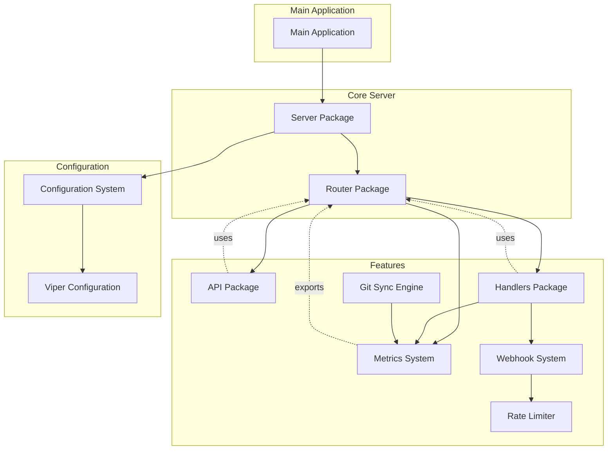
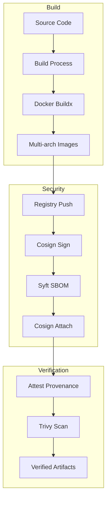
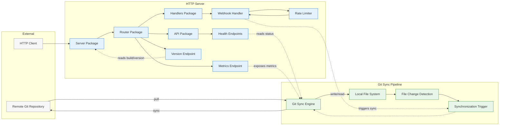
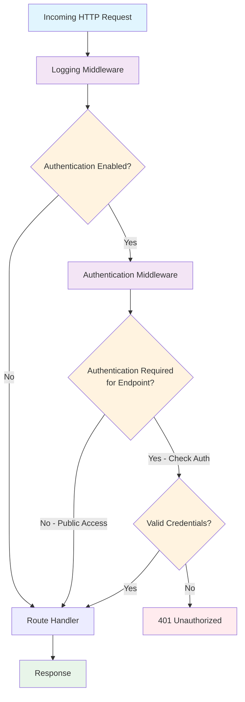
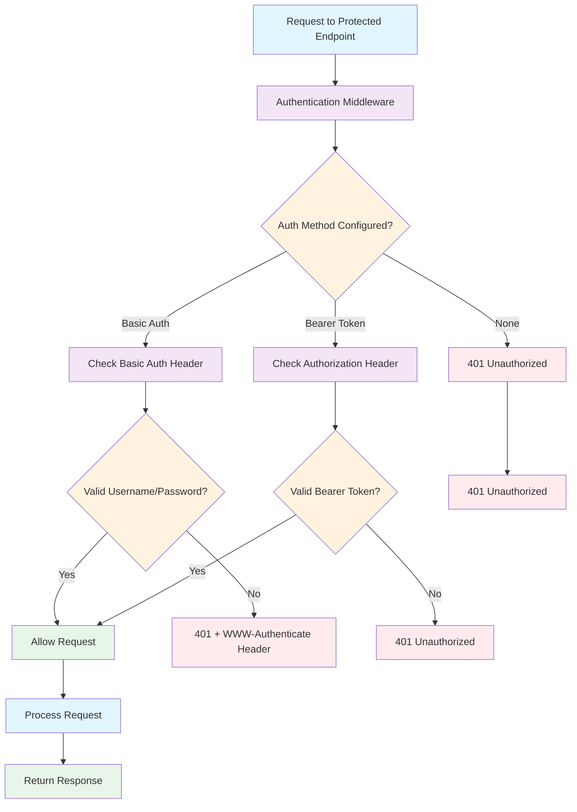

# Architecture

This document describes the architecture of the git-sync service and its supply chain security implementation.

## System Architecture

The git-sync service is a Go application that provides synchronization between a remote Git repository and a local directory. The service exposes several HTTP endpoints for monitoring and management.

### Prerequisites

- **Go 1.23+**: The main programming language used for this project
- **Docker**: For containerization and deployment
- **Make**: For build automation

### Core Components

1. **Git Synchronization Engine**: Responsible for cloning and synchronizing the remote repository with the local directory
2. **HTTP Server**: Provides API endpoints for monitoring, management, and health checks
3. **Configuration System**: Unified configuration management supporting flags, environment variables, and config files
4. **Metrics System**: Prometheus metrics collection and exposure
5. **Logging System**: Structured logging with debug capabilities
6. **Webhook System**: Handles incoming webhooks for manual synchronization triggers
7. **Rate Limiting**: Controls the frequency of webhook requests to prevent abuse

### Component Diagram



## Supply Chain Architecture

Our supply chain security follows a comprehensive approach to ensure the integrity and security of our artifacts from source to deployment.

### Supply Chain Flow



### Detailed Supply Chain Steps

1. **Source Code**: Code is maintained in a Git repository with signed commits
2. **Build Process**: GitHub Actions workflows orchestrate the build process
3. **Docker Buildx**: Multi-architecture images are built using Docker Buildx
4. **Registry Push**: Images are pushed to GHCR and Docker Hub
5. **Cosign Sign**: Images are signed with keyless cosign
6. **Syft SBOM**: Software Bill of Materials is generated in CycloneDX format
7. **Cosign Attach**: SBOM is attached to the image as an OCI artifact
8. **Attest Provenance**: SLSA provenance attestation is created
9. **Trivy Scan**: Images are scanned for vulnerabilities
10. **Verified Artifacts**: Final artifacts are signed, scanned, and attested

### Security Controls

1. **Immutable Images**: Images are referenced by digest to prevent tag mutability attacks
2. **Keyless Signing**: Eliminates private key management complexity and security risks
3. **SBOM Generation**: Provides complete inventory of software components
4. **Vulnerability Scanning**: Automatic detection of known vulnerabilities
5. **Provenance Attestation**: Verifiable build metadata for supply chain transparency

## Deployment Architecture

The git-sync service can be deployed in various environments:

### Docker Deployment

```shell
docker run -v /local/path:/git \
  -e GITSYNC_REPOSITORY_URL=https://github.com/user/repo.git \
  -e GITSYNC_REPOSITORY_BRANCH=main \
  ghcr.io/username/git-sync:latest
```

### Kubernetes Deployment

```yaml
apiVersion: apps/v1
kind: Deployment
metadata:
  name: git-sync
spec:
  replicas: 1
  selector:
    matchLabels:
      app: git-sync
  template:
    metadata:
      labels:
        app: git-sync
    spec:
      containers:
      - name: git-sync
        image: ghcr.io/username/git-sync:latest
        env:
        - name: GITSYNC_REPOSITORY_URL
          value: "https://github.com/user/repo.git"
        - name: GITSYNC_REPOSITORY_BRANCH
          value: "main"
        volumeMounts:
        - name: git-volume
          mountPath: /git
      volumes:
      - name: git-volume
        emptyDir: {}
```

## Monitoring Architecture

The service exposes several types of monitoring information:

### Health Checks

- `/health`: Detailed health information including Go runtime stats
- `/ready`: Readiness status for Kubernetes probes
- `/status`: Basic status information

### Metrics

All metrics are exposed via the `/metrics` endpoint in Prometheus format:

- `sync_requests_total`: Total number of synchronization requests
- `sync_duration_seconds`: Time spent on synchronization operations
- `sync_errors_total`: Total number of synchronization errors
- `repo_sync_info`: Information about the synchronized repository
- `repo_commit_info`: Information about the latest commit
- `build_info`: Build information with version metadata

### Version Information

Version information is available through multiple channels:

- `--version` CLI flag
- `/version` HTTP endpoint
- `build_info` Prometheus metric

## Data Flow



## Security Architecture

### Credential Management

The service supports multiple approaches for secure credential management:

1. **Environment Variables**: For development and simple deployments
2. **Configuration Files**: For more complex configurations
3. **File-based Tokens**: For production environments with secret management systems
4. **Docker Secrets**: For Docker Swarm deployments
5. **Kubernetes Secrets**: For Kubernetes deployments

### Network Security

- All HTTP endpoints can be protected with authentication
- TLS support for secure communication
- Configurable binding addresses for network isolation

### Runtime Security

- Non-root user execution in Docker containers
- Minimal base image (Alpine Linux)
- ReadOnly root filesystem where possible
- Proper volume permissions for git repository access

## Technology Stack

### Core Technologies

- **Go**: Programming language
- **go-git**: Pure Go Git implementation
- **Viper**: Configuration management
- **Prometheus**: Metrics collection
- **Alice**: HTTP middleware chaining

### HTTP Server Architecture

- **Server Package**: HTTP server lifecycle management
- **Router Package**: Centralized routing system with middleware support
- **API Package**: REST API endpoints for monitoring and management
- **Handlers Package**: Specialized handlers for webhooks and metrics

### Build and Deployment

- **Docker**: Containerization
- **Buildx**: Multi-architecture builds
- **Cosign**: Image signing
- **Syft**: SBOM generation
- **Trivy**: Vulnerability scanning

### CI/CD

- **GitHub Actions**: CI/CD platform
- **Docker Hub/GHCR**: Container registries
- **SLSA**: Provenance attestation

## Versioning Strategy

The service follows Semantic Versioning (SemVer) with the following scheme:

- `vMAJOR.MINOR.PATCH` for releases
- `vMAJOR.MINOR.PATCH-rc.N` for release candidates
- Build metadata injection at compile time:
  - Version tag from Git
  - Commit hash
  - Build date
  - Dirty flag (uncommitted changes)

## Future Architecture Improvements

1. **Enhanced Observability**: Additional metrics and tracing
2. **Multi-repository Support**: Synchronize multiple repositories simultaneously
3. **Webhook Enhancements**: More sophisticated webhook handling
4. **Advanced Scheduling**: Cron-like synchronization scheduling
5. **Plugin Architecture**: Extensibility through plugins

## HTTP Server Architecture

The HTTP server architecture has been redesigned to eliminate circular dependencies and improve modularity. The new architecture consists of three main components:

### Server Package

- Manages the HTTP server lifecycle
- Coordinates between the router and route registration
- Initializes middleware and starts the server

### Router Package

- Centralized routing system for all HTTP endpoints
- Provides a unified way to register and document routes
- Handles middleware chaining and authentication
- Manages route documentation and root endpoint listing

### Route Providers (API and Handlers Packages)

- Register their routes with the router using a standardized interface
- Implement specific business logic for their endpoints
- Maintain loose coupling with the HTTP server implementation

This architecture eliminates the previous circular dependencies while maintaining all functionality, including:

- Route registration from multiple packages
- Middleware support (authentication)
- Automatic route documentation
- Proper error handling

### Package Dependencies

The new architecture enforces a clean dependency flow:

```text
Main Application → Server Package → Router Package, API Package, Handlers Package
API Package → Router Package (for route registration)
Handlers Package → Router Package (for route registration)
```

This structure ensures that there are no circular dependencies while maintaining a clean separation of concerns.

### Webhook and Rate Limiting Architecture

The webhook system provides a mechanism for external triggers to initiate synchronization:

1. **Webhook Handler**: Processes incoming POST requests to `/webhook`
2. **Rate Limiter**: Controls request frequency to prevent abuse
3. **Synchronization Trigger**: Sends signals to the Git sync engine
4. **Metrics Collection**: Tracks webhook request statistics

The rate limiter uses a token bucket algorithm to control request frequency per IP address, with automatic cleanup of expired entries.

## HTTP Server Workflow and Authentication

The HTTP server implements a layered approach to request handling with authentication middleware that protects endpoints while allowing public access to specific endpoints as needed.

### Request Flow Diagram



### Authentication Logic

The authentication system supports two methods with consistent security policies:

1. **Basic Authentication**: Username and password
2. **Bearer Token Authentication**: Token-based authentication

Both methods implement the same security policy:
- Root endpoint [/](file://v:\GitHub\git-sync\CHANGELOG.md) is publicly accessible (dashboard)
- Webhook endpoint [/webhook](file://v:\GitHub\git-sync\internal\handlers\handlers.go#L49-L49) is publicly accessible when enabled (for external triggers)
- All other endpoints require authentication

### Endpoint Security Matrix

| Endpoint | Public Access | Basic Auth | Bearer Token |
|----------|---------------|------------|--------------|
| [/](file://v:\GitHub\git-sync\CHANGELOG.md) | ✅ Yes | N/A | N/A |
| [/metrics](file://v:\GitHub\git-sync\internal\handlers\handlers.go#L46-L46) | ❌ No | ✅ Required | ✅ Required |
| [/health](file://v:\GitHub\git-sync\api\api.go#L52-L52) | ❌ No | ✅ Required | ✅ Required |
| [/ready](file://v:\GitHub\git-sync\api\api.go#L53-L53) | ❌ No | ✅ Required | ✅ Required |
| [/status](file://v:\GitHub\git-sync\api\api.go#L51-L51) | ❌ No | ✅ Required | ✅ Required |
| [/version](file://v:\GitHub\git-sync\api\api.go#L54-L54) | ❌ No | ✅ Required | ✅ Required |
| [/webhook](file://v:\GitHub\git-sync\internal\handlers\handlers.go#L49-L49) | ✅ Yes* | N/A | N/A |

*Only when webhook is enabled in configuration

### Metrics Endpoint Security

The metrics endpoint (`/metrics`) exposes Prometheus-formatted metrics including:
- Synchronization statistics
- Error counts
- Performance metrics
- System health information

This endpoint requires authentication to prevent unauthorized access to operational data that could be valuable to potential attackers.

### Detailed Authentication Flow



This architecture ensures consistent security policies across all authentication methods while maintaining the usability of public endpoints like the dashboard.
